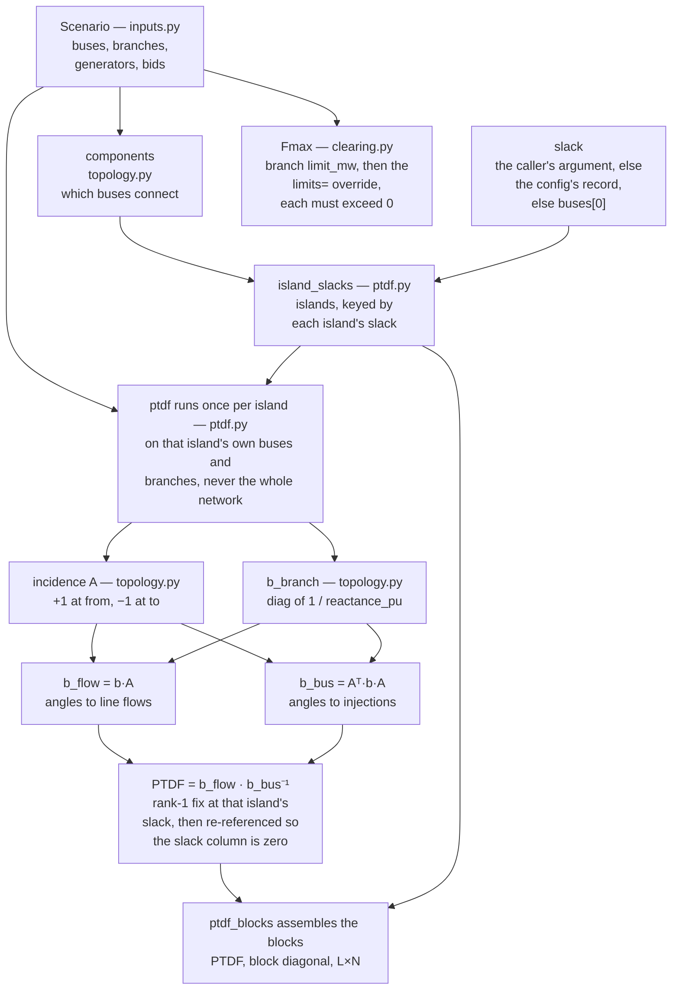
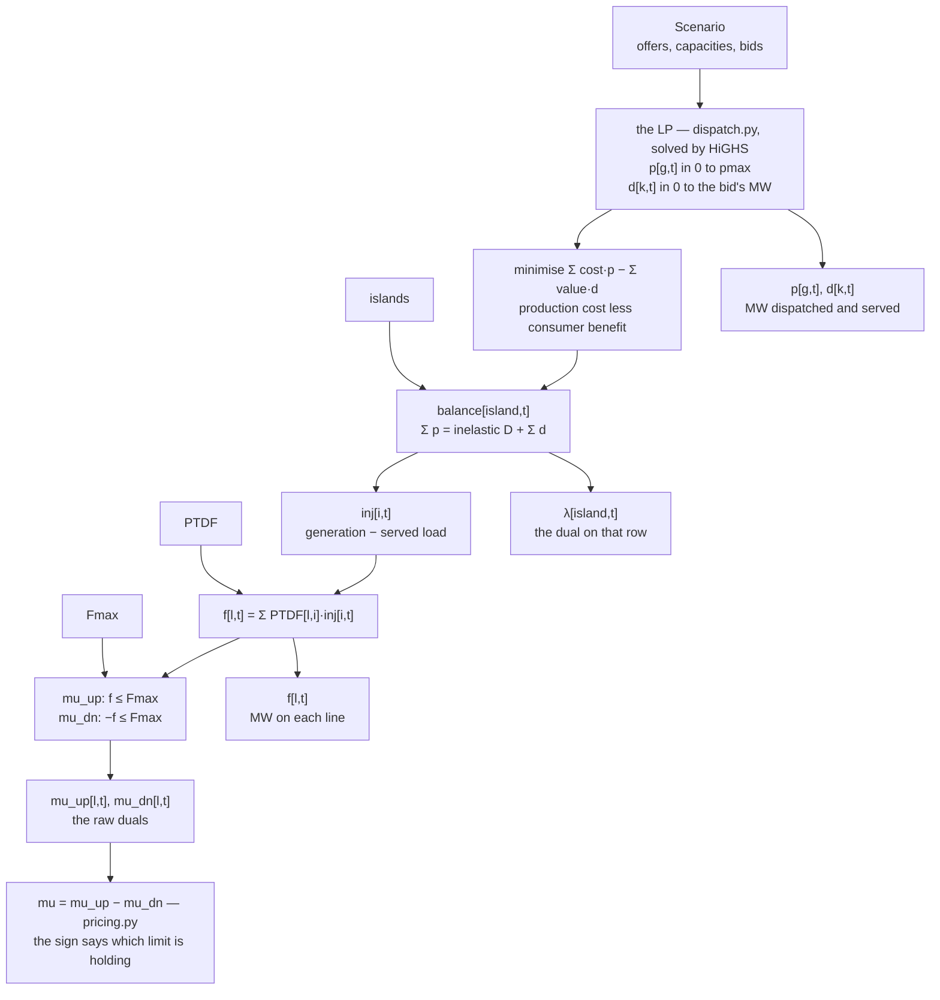
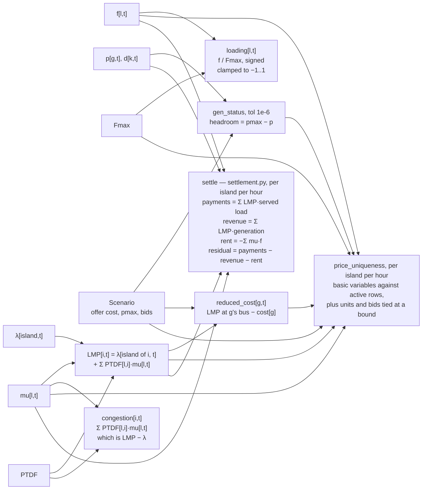
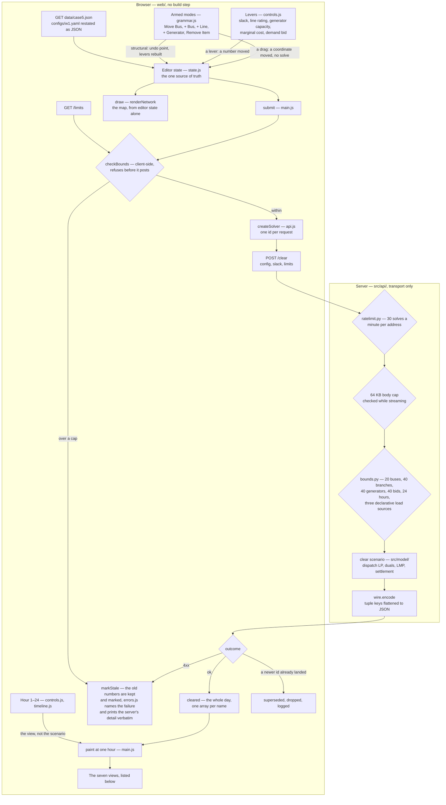

# Market Engine Sandbox

This is a basic interactive electricity market sandbox. Given generator
offers, a load forecast, and a transmission network with limits, it answers
who runs, at what output, and the local electricity price at each bus.

The levers include adding a bus and connecting a line, so every solve is live.
Move the `DE` rating down. As the line binds, the five buses stop sharing one
price and a congestion component appears beside λ.

## Price Definition

Prices are dual variables. The dual on the energy balance constraint is the
marginal cost of serving one more MW, and that is the price — it is not
computed by a pricing rule, it falls out of the optimization.

    LMP[i] = λ + Σ PTDF[l,i] · μ[l]

λ is the dual on the island's energy balance and is the same at every bus in
that island. μ[l] is the dual on line l's flow limit, zero unless the line is
binding, and its sign carries which direction the line binds in. The sum is
the congestion component.

The settlement residual is on the page, in the Islands panel:

    payments − revenue = −Σ μ[l] · f[l]

Both sides are reached independently — once from the money, once from the
duals — and the residual verifies that they agree. 

## Price Computation

The stage each quantity is produced at, and what it is produced from. One
`clear()` call runs all three charts; in the page flowchart further down, all of
this is the single node `clear scenario`.

### The Matrices, Before Any Solve

### The Solve

### The Prices, Off Its Duals

### Where Each Quantity Comes From

| Quantity | Computed in | Inputs |
|---|---|---|
| `A`, incidence | `topology.py:incidence` | buses, branches |
| `b`, susceptance | `topology.py:b_branch` | branch `reactance_pu` |
| `b_flow` | `topology.py:b_flow` | `b · A` |
| `b_bus` | `topology.py:b_bus` | `Aᵀ · b · A` |
| islands | `topology.py:components`, `ptdf.py:island_slacks` | buses, branches, slack |
| `PTDF` | `ptdf.py:ptdf`, assembled by `ptdf_blocks` | `b_flow`, `b_bus`, one slack per island |
| `Fmax` | `clearing.py` | branch `limit_mw`, then the `limits=` override |
| `p`, `d` | `dispatch.py`, HiGHS | offers, capacities, bid values and quantities |
| `λ` | `dispatch.py`, dual on `balance[island, t]` | the LP |
| `f` | `dispatch.py`, the flow expression | `PTDF`, injections |
| `mu_up`, `mu_dn` | `dispatch.py`, duals on the two limit rows | the LP, `Fmax` |
| `mu` | `pricing.py:congestion_prices` | `mu_up − mu_dn` |
| `LMP` | `pricing.py:lmps` | `λ`, `PTDF`, `mu`, the island each bus is in |
| congestion component | `pricing.py:congestion` | `PTDF`, `mu` |
| `gen_status`, `headroom` | `pricing.py` | `p`, `pmax` |
| `reduced_cost` | `pricing.py:reduced_costs` | `LMP`, offer `cost`, each unit's bus |
| `loading` | `pricing.py:line_loading` | `f`, `Fmax` |
| uniqueness verdict | `pricing.py:price_uniqueness` | `gen_status`, `mu`, `f`, `Fmax`, `LMP`, `reduced_cost`, bids |
| settlement, residual | `settlement.py:settle` | `LMP`, served load, generation, `mu`, `f` |

Two of those are worth reading twice. `λ` is the dual on the energy balance
row, and nothing else computes it: the LP hands it back. And `mu` carries a
sign rather than a magnitude, positive at the lower limit and negative at the
upper, which is why the rent is written against the flow and never against
the rating.

## Scope

A nodal energy market, DC approximation, 24-hour day-ahead solve, on the
PJM/MATPOWER five-bus case (`case5`) with five synthetic generators and
cost-based offers.

What is **not** modelled, and is not hidden in a footer:

- **No unit commitment.** No startup cost, no minimum up or down time, no
  minimum stable output. A pure LP will part-load a unit at any level.
- **No storage and no reserves.**
- **No losses.** The DC approximation is lossless, so the marginal loss
  component of a real LMP is absent — it is zero here, not small.
- **No validation against published prices.** Absolute levels will be wrong;
  the fleet is synthetic. What should match real markets is structure — when
  prices separate, when the evening ramp bites, which hours go negative.

An LMP here is not bounded by the offer cap. The cap bounds a bid; an LMP is
λ plus a shadow price on a line, and the second term has no bound in either
direction. Measured on the shipped case with the fleet at half capacity, `AB`
rated 50 MW and `DE` 240 MW, six of the twenty-four hours price some bus
above the $5000/MWh cap:

    hour 19    LMP[B]   $6245.2763      against a $5000.00 bid cap
               LMP[A]   -$327.3447
               residual  0.0            the identity is untouched

Clipping the LMP at the cap is the obvious-looking fix and it breaks the
identity the repo rests on: add a 5 MW unit at B, pay it the clipped price,
and the residual goes from `0.0` to $6226.3815. The range is disclosed
instead.

## Running It Locally

From the repo root — the server resolves `web/` relative to its own file, and
a copy installed into site-packages has no `web/` beside it.

    python -m venv .venv && source .venv/bin/activate
    pip install -e ".[dev]"
    uvicorn src.api.app:app --reload --port 8000

Then open `http://localhost:8000`. The `dev` extra carries `pytest` and the
`httpx` that backs `fastapi.testclient`, which the base install does not:

    pytest

## How the Page Works

The chart is the page as it stands. Every change routes through one state
object in `state.js`, and `api.js` is the only module that posts.

The rate limiter runs before the server reads the body, so a refused caller
costs this process a dict lookup rather than 64 KB of streaming. Every bound
rejects by name and never truncates. `bounds.py` allows three declarative
load sources and nothing else, because `eia930` would let a stranger's POST
spend this server's API key on a live EIA call.

Moving the hour does not re-solve. `clear()` returns the whole day, so the
hour indexes an answer the browser already holds. Posting for it would be a
second answer to a question already answered, and at a degenerate breakpoint
the two could differ with nothing on screen to explain why.

Dragging a bus does not re-solve either. Coordinates are editor state and
never cross the wire, and no price depends on them, so the map redraws
immediately while the prices on it stay whatever the last solve said.

`api.js` coalesces requests without debouncing them. Every lever movement
still solves, and a response is applied only if its id beats the highest
already applied, which keeps a drag from rendering the prices of a network
the visitor has edited away from. Nothing is delayed or averaged, so the
price flicker at a degenerate breakpoint reaches the screen.

Price Formation Overview sits above the frame, carrying λ, the congestion
component and the absent loss component as three columns. Then the panels, in
order: Network, with its toolbar and the 24-hour timeline under it; Levers;
Locational Marginal Price (LMP); Merit Order; Line Flows Against Limits;
Generation by Unit; Islands and the Settlement Residual; then Editor State,
Against the Server Caps, Traffic, and What Is Posted, which carries the exact
body and its size against the cap.

## Layout

    src/network/    susceptance matrix, PTDF shift factors
    src/model/      dispatch LP, pricing from the duals
    src/settle/     the settlement identity
    src/api/        FastAPI over clear(). transport only, no maths
    web/            the browser build. no toolchain, no build step
    configs/        one YAML file per scenario, fully declarative
    tests/          test_<milestone>_<context>.py

No market arithmetic happens in JavaScript. The browser formats numbers and
positions marks; every number on screen is a field of the `clear()` return.
A second implementation of the LMP assembly, in a second language, would be a
new place for a sign convention to be wrong.

## Deploy Notes

The container and the per-address rate limit on `/clear` — the only endpoint
that starts a solve — are in `Dockerfile` and `src/api/ratelimit.py`. Input
bounds were already in place: 64 KB body, at most 20 buses, 40 branches, 40
generators, 40 bids and 24 hours, and only the declarative load sources, each
rejected by name rather than truncated.

`MARKET_ENGINE_MAX_SOLVES_PER_MIN` (default 30) and `MARKET_ENGINE_ORIGINS`
(default `*`) are the two knobs a deploy has.

## License

MIT.
